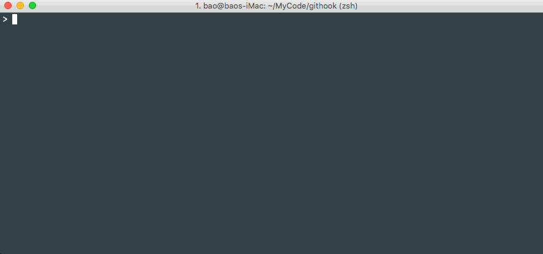
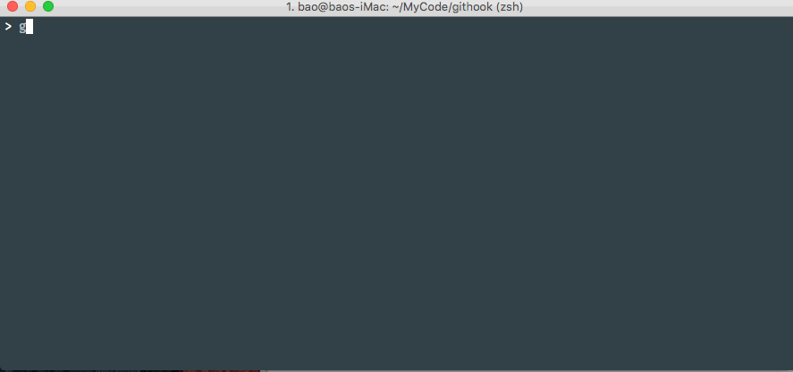

# Githook

A ruby gem that help to setup git hooks easily, base on Rake, inspired from Capistrano.

## TODO

- [x] install task
- [x] setup hooks task
- [x] clear hooks task
- [x] disable/enable hooks task
- [x] list hooks task
- [x] version/help task
- [x] pre-commit hook tasks
- [x] prepare-commit-msg hook tasks
- [x] commit-msg hook tasks
- [x] implement as a gem
- [x] more document

## Installation

Add this line to your application's Gemfile:

```ruby
gem 'git-hook'
```

And then execute:

    $ bundle

Or install it yourself as:

    $ gem install git-hook

## Usage

Help:

    $ githook help
    Usage: githook task_name

    task_name:
      install  -- Init githook, create .githook folder, prepare template files
      setup    -- Setup hooks, copy hooks from .githook/hooks to .git/hooks
      backup   -- Backup old hooks in .git/hooks
      clearup  -- Clear backup hooks in .git/hooks
      disable  -- Disable hooks: [HOOKS=pre_commit,commit_msg] githook disable
      enable   -- Enable hooks: [HOOKS=pre_commit,commit_msg] githook enable
      list     -- List all hooks
      version  -- Version
      help     -- Help

Getting started:

    $ githook install
    $ githook setup

Demos:

1. install, setup hooks

   

1. pre-commit, prepare-commit-msg, commit-msg hooks

   

1. disable, enable, list hooks

   

## Principle

Git will call some hooks when you commit, merge, rebase code, etc. The hooks place in `.git/hooks` folder, there are many default sample hooks, you need remove the `.sample` suffix to make it works if you want to execute the hook. The 3 hooks are most useful for us: `pre-commit`, `prepare-commit-msg`, `commit-msg`.

`pre-commit` hook will be executed at the most begining when commit code, `prepare-commit-msg` hook will be executed after `pre-commit` hook, before you start to input some commit message, `commit-msg` hook will be executed after you save the commit message.

[See more hooks introduction in git official website - Customizing Git - Git Hooks](https://git-scm.com/book/gr/v2/Customizing-Git-Git-Hooks).

The default behavior of these 3 hooks are a few, but we can add more additional behaviors.

In `pre-commit`, we add the following code:

    # custom pre-commit hooks
    githook pre_commit
    if [ $? -ne 0 ]; then
      exit 1
    fi

We will execute `githook pre_commit` in `pre-commit`, if it fails, it will abort later operations.

What does `githook pre_commit` do? don't forget the githook base on Rake, so the `pre_commit` is a task defined in `tasks/pre-commit.rake`:

    desc "Run all pre-commit hook tasks"
    task :pre_commit do |t|
      Githook::Util.log_task(t.name)
      Githook::Util.run_tasks(t.name.to_sym)
    end

It nearly does nothing but just calls `Githook::Util.run_tasks(:pre_commit)`, let's continue to dive into `run_tasks()`, it is defined in `util.rb`:

    def self.run_tasks(hook_stage)
      tasks = fetch(hook_stage, [])
      tasks.each do |task|
        if Rake::Task.task_defined?(task)
          Rake::Task[task].invoke
        else
          puts "#{task} task doesn't exist."
        end
      end
    end

So it will get the value of `:pre_commit`, if it is an empty array, then nothing will happen, else, it will traverse this array, execute all the tasks in this array one by one.

Where do we define the `:pre_commit` value? It is defined by user in `.githook/config.rb`, let's see how it looks like by default:

    set :pre_commit, fetch(:pre_commit, []).push(
      # uncomment following lines if it is a ruby project
      # "pre_commit:rubocop",
      # "pre_commit:rspec",

      # uncomment following lines if it is an android or java project built by gradle
      # "pre_commit:checkstyle"
    )
    set :prepare_commit_msg, fetch(:prepare_commit_msg, []).push(
      # comment following lines if you want to skip it
      "prepare_commit_msg:prepare"
    )
    set :commit_msg, fetch(:commit_msg, []).push(
      # comment following lines if you want to skip it
      "commit_msg:check_msg"
    )

We use `set` method to set the value. It seems the `:pre_commit` value is an empty array by default, all items are commented, so `githook pre_commit` in `pre-commit` hook will do nothing, but if your project is a ruby or rails project, there are 2 default tasks are prepared for `:pre_commit`, they are `pre_commit:rubocop` and `pre_commit:rspec` (also has a default task `pre_commit:checkstyle` prepared for android or java project), if you uncomment the above 2 lines code, then `pre_commit:rubocp` and `pre_commit:rspec` will be executed when you commit code, of course, you can define your customized tasks and add to hooks (later I will introduce how to add a customized task).

How do the default tasks `pre_commit:rubocop` and `pre_commit:rspec` look like, they are defined in `tasks/pre-commit.rake`:

    namespace :pre_commit do
      desc "Check ruby code style by rubocop"
      task :rubocop do |t|
        Githook::Util.log_task(t.name)
        exit 1 unless system("bundle exec rubocop")
      end

      desc "Test ruby code by rspec"
      task :rspec do |t|
        Githook::Util.log_task(t.name)
        exit 1 unless system("bundle exec rspec")
      end

      desc "Check java code style by checkstyle"
      task :checkstyle do |t|
        Githook::Util.log_task(t.name)
        exit 1 unless system("./gradlew checkstyle")
      end
    end

The `pre_commit:rubocop` just simply runs `bundle exec rubocop` command to check ruby code style, while `pre_commit:rspec` runs `bundle exec rspec` to test ruby code. (`pre_commit:checkstyle` runs the `./gradlew checkstyle` command.)

At last, let's see what do `prepare_commit_msg:prepare` and `commit_msg:check_msg` tasks do?

The `prepare_commit_msg:prepare` is defined in `tasks/prepare-commit-msg.rake`, it is executed in `prepare-commit-msg` hook. It will check whether the commit message is empty, if it is, it will help generate the commit message according the branch name, for example, if the branch name is `feature/24_add_help_task`, then the auto generated commit message is "FEATURE #24 - Add help task".

    namespace :prepare_commit_msg do
      desc "Prepare commit msg"
      task :prepare do |t|
        Githook::Util.log_task(t.name)

        commit_msg_file = Githook::Util.commit_msg_file
        commit_msg = Githook::Util.get_commit_msg(commit_msg_file)
        if Githook::Util.commit_msg_empty?(commit_msg)
          branch_name = Githook::Util.branch_name
          pre_msg = Githook::Util.gen_pre_msg(branch_name)
          puts "pre-msg:"
          puts pre_msg
          Githook::Util.prefill_msg(commit_msg_file, pre_msg)
        end
      end
    end

The `commit_msg:check_msg` is defined in `tasks/commit-msg.rake`, it is executed in `commit-msg` hook after you save the commit message. It will check your commit message style, if it doesn't match the expected format, then this commit will be aborted. In default, our expected commit message summary format is "FEAUTER|BUG|MISC|REFACTOR #issue_num - Summary", if you prefer to use other format, you need to define yourself task to replace the default behavior.

    namespace :commit_msg do
      desc "Check commit msg style"
      task :check_msg do |t|
        Githook::Util.log_task(t.name)

        commit_msg_file = Githook::Util.commit_msg_file
        commit_msg = Githook::Util.get_commit_msg(commit_msg_file)
        puts "commit-msg:"
        puts commit_msg.join("\n")
        exit 1 unless Githook::Util.check_msg_format?(commit_msg)
      end
    end

## Customize yourself task

The default `pre_commit:rubocp`, `pre_commit:rspec` tasks will help you check ruby code style and test ruby code before commit, the `prepare_commit_msg:prepare` task will help auto generate commit message according branch name when commit code, the `commit_msg:check_msg` task will help check commit message style after save the commit message.

If you don't like these default behaviors, for example you have your own commit message style, or you want to add more checks, for example you want to be more strict in the branch name, you can't name a branch arbitrarily, it must follow some rules, it should be one of `develop/staging/master`, `/^(feature|bug|hotfix|misc|refactor)\/(\d*)?(\w*)/`, let's try to implement this custom task.

We can define it in any rake file in `.githook/tasks` folder, there is already an empty `tasks.rake` file, so let's just define in it. It should work in `pre-commit` hook, so let's define it in `:pre_commit` namespace.

    # .githook/tasks/tasks.rake
    namespace :pre_commit do
      desc "Check branch name style"
      task :check_branch_name do
        expected_branch_reg = /^(feature|bug|hotfix|misc|refactor)\/(\d*)?(\w*)/
        branch_name = Githook::Util.branch_name
        if branch_name.include?("/")
          valid = expected_branch_reg.match(branch_name)
        else
          valid = %w(develop staging master).include?(branch_name)
        end
        unless valid
          puts "Branch name #{branch_name} doesn't match the expected foramt."
          exit 1
        end
      end
    end

Finally, don't forget to enable this task in `.githook/config.rb`:

    # .githook/config.rb
    set :pre_commit, fetch(:pre_commit, []).push(
      "pre_commit:check_branch_name"
    )

Demo:



## References

1. [Git Hooks Sample](https://github.com/baurine/git-hooks-sample)
1. [Step-by-Step Guide to Building Your First Ruby Gem](https://quickleft.com/blog/engineering-lunch-series-step-by-step-guide-to-building-your-first-ruby-gem/)

## License

The gem is available as open source under the terms of the [MIT License](http://opensource.org/licenses/MIT).
